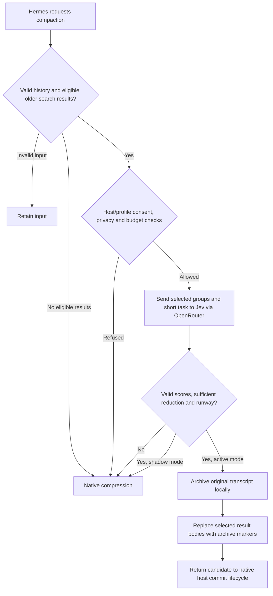

# How it works

## The narrow idea

Jev scores whether an eligible older tool group is still needed for the current task. The plugin uses those scores as one input to a conservative pruning decision. It does not ask Jev to answer the task, replace the main model, choose a model or manage memory.

In the supported personal setup, eligible groups contain only `web_search` results. Even a large session may have no eligible groups. A long current turn is protected, so a single uninterrupted research turn can remain ineligible too.

## What is protected

The plugin preserves the configured native head/tail protection and compaction settings rather than lowering them to force activity. It also protects the latest user request and everything after it. Tool calls and results must remain structurally paired.

Groups with unsupported message fields, non-text results, explicit evidence/protection flags, errors or matching protection keywords are excluded. These are conservative heuristics, not a guarantee that every important fact will be recognized.

The personal setup cannot expand beyond `web_search`. The code includes explicit public/synthetic fixture support for research, but that is not approval to send arbitrary file or terminal content from a real session.

## A compaction attempt

1. Validate the transcript structure and bound the serialized input.
2. Select at most eight eligible older groups outside the protected regions.
3. Obtain the configured short task description. The personal setup uses the latest user text, with a 2,048-byte limit. Unsupported or oversized task content falls back rather than using stale history.
4. Apply scope exclusions and the native sensitive-text detector. If redaction would change the payload, refuse the scoring request rather than silently altering the evidence.
5. Reserve local budget before the request. Send the projected tool groups, including tool arguments, and task text through OpenRouter's Decisions endpoint.
6. Require the expected provider/model, valid probability scores, bounded usage and reported cost. Unknown or unsettled spend prevents subsequent calls.
7. Consider only very low keep-probability results. Check minimum reduction, estimated context runway and preserved message structure.
8. In active mode, save the original transcript in a local archive before replacing selected result bodies. In shadow mode, use native compression instead of committing the pruning candidate.
9. Return through the native host lifecycle. The host, not the plugin metric, determines whether the candidate is committed.

If Jev scoring fails, the plugin normally uses the native compressor. Invalid source structure or other unsafe conditions can retain input instead. Native fallback can itself fail. Fallback is not a mechanism for detecting every incorrect low score.

## Data flow

| Data | Destination |
|---|---|
| Eligible selected tool groups and short task | OpenRouter, then TypeSafe Jev |
| System prompt and unrelated history | Not deliberately included in the Jev payload |
| Full original transcript before active pruning | Local archive under the selected profile's state directory |
| Outcome, candidate counts/bytes, elapsed time, reported cost | Local metrics file |
| Reservations, accounted charges, settlement state | Local SQLite budget ledger |
| Existing memory-store data | No direct reads, writes or migration by this plugin |

Text already embedded in an eligible search result or task can still be sensitive. “Not deliberately included” is not a data-loss-prevention guarantee. Read [SECURITY.md](../SECURITY.md).

The client requests zero-data-retention routing, denied data collection, no provider fallback and required parameter support. Those requested flags are not independent proof of the provider's retention behavior. If the required route or response cannot be verified, the plugin falls back.

## Budget behavior

Budgets are local admission controls, not provider-enforced spending caps. The ledger reserves an amount before dispatch and records reported usage afterward. A crash, timeout, missing cost or untrusted response can leave an unsettled entry that blocks further scoring. Do not delete it to get the plugin running again: reconcile it against provider usage first.

The current scorer requires at least a $0.02 per-call reservation. That is conservative admission accounting, not a prediction of the actual charge. A timeout kills the local transport child but cannot guarantee remote cancellation or zero billing. There are no automatic scoring retries.

Status reports distinguish accounted amount, reported actual cost and outstanding reservations. Do not add the metrics charge to the ledger charge; they can describe the same request.

## What a successful experiment might show

A research-heavy task could need fewer or smaller subsequent context operations because obsolete search results were removed. That could improve completion time, context availability or usage. Jev scoring also adds latency, an external dependency and a charge. Bad pruning can cost more than it saves.

These are possible outcomes, not promises. A file-heavy coding task may show no change. A session with no eligible old results should use native compression. A run can produce fewer bytes and still be slower, more expensive or less accurate.

## Rollback is not time travel

Selecting the native `compressor` and relaunching stops future Jev use. It does not automatically merge archived context back into an existing conversation. The local archives support investigation, but there is no automatic “restore every discarded detail” command. Test recovery with synthetic data and keep important source material independently available.

See [INSTALL.md](INSTALL.md) for the actual supported commands and [EVALUATION.md](EVALUATION.md) for measurement.
